# Client-readiness implementation gap map

Date: 2026-08-17; status updated 2026-08-18

Execution plans: [original implementation plan](client-ready-implementation-plan.md), [verified phase 2 plan](client-ready-phase-2-plan.md), and [active phase 3 plan](client-ready-phase-3-plan.md)

## Decision

Inn now has a state-changing staff booking/change/payment/cancellation/refund browser journey in addition to the domain and UI foundation for manual bank-transfer review. It is not yet client-complete end to end because guest evidence approval, stay operation/checkout, documents/exports, production communications, deployment/recovery, online payments, and provider integrations remain open or explicitly provider-gated.

The strongest implemented areas are tenant isolation, roles, the master calendar, guarded reservation state transitions, conflict-aware allocations, operational tasks, housekeeping, guest itinerary/pre-registration, folios, manual payments, CRM, proposals, surveys, retail, and finance projections.

The remaining client-facing breaks are:

1. The guest portal cannot take an online payment. It supports a now-complete, controlled manual bank-transfer flow.
2. Payment-gateway, accounting, e-signature, webhook, SMS/WhatsApp, and channel connections are configuration records rather than working provider integrations.
3. Guarded amendments, room moves, priced cancellations, and internal refunds now form one browser-proven journey, but N2.1 temporal/financial collisions, provider refunds, legal invoices, document generation, and exports remain.
4. Production mail delivery, object storage, monitoring, backup/restore, and provider reconciliation still require deployment decisions and production UAT.

The 2026-08-18 N2 milestone made the generic reservation API quote-authoritative and added append-only guarded amendment, room assignment/move/swap, cancellation/no-show fee, and partial/full internal refund commands. One authenticated Playwright journey now mutates that full loop; the remaining N1 guest/stay/role/mobile journeys stay open.

## Evidence standard

This map uses four statuses:

- **Client-complete**: the entire journey was executable through the product, with persisted results and an appropriate automated acceptance test.
- **Domain-complete**: real rules and persistence exist, but the client journey is incomplete or fragmented.
- **Scaffold**: a model, form, adapter boundary, or test double exists without a working provider or operational loop.
- **Missing**: the required behavior is absent.

The 2026-08-18 verification combined source inspection, runtime health, 224 passing PHPUnit tests with 1,548 assertions, and five passing authenticated Playwright tests against seeded PostgreSQL. Four are route/render smoke journeys; the N2 test is state-changing. A single N2 loop does not establish completion of the remaining guest, stay, document, provider, role, mobile, or production journeys.

## Client journeys

| Journey | Current evidence | Status | Missing implementation | Release gate |
| --- | --- | --- | --- | --- |
| Search availability and create a priced reservation | Availability-first composer; deterministic quote; atomic hold/allocation; browser create → confirm → amend → move with immutable history | Client-complete for the exercised staff/N2 slice | Repeat-guest/companion mutation, calendar persistence assertion, role/mobile/error journeys | Phase 3 UAT covers the remaining variants without staff-entered totals |
| Guest books directly | Public application is a marketing site and links staff to the protected Filament application | Missing | Public availability search; quote; guest details; consent; hold expiry; online payment; confirmation; bot/rate-limit protection; analytics | A guest can book and pay from the public site without staff intervention |
| Hold, collect deposit, and confirm | Guarded transitions, expiring atomic holds, configurable fixed/percentage deposit policies, and selected policy provisioning | Domain-complete; manual collection path complete | Hosted payment request/link, provider status, and failed/late online-payment handling | A selected deposit policy provisions deterministically; a manual evidence approval changes payment/deposit projections exactly once |
| Guest pays online | Portal shows balance and accepts a file as evidence | Missing | Hosted checkout; payment attempt/session; success/cancel return; webhook; receipt; balance refresh; no raw card storage | Guest pays a partial or full amount and sees the resulting balance |
| Staff reviews bank-transfer evidence | Guest-declared amount/currency/reference; scan hook; finance review queue; secure private download; approve/reject/request-more-info; reviewer audit; exact-once payment and deposit reconciliation | Domain and UI implemented | Guest upload → staff approval browser UAT; production object-storage retention and external malware service | Browser UAT proves one approval creates one payment/folio effect and rejection creates none; `PaymentEvidenceReviewTest` retains failure/idempotency coverage |
| Amend dates, occupancy, room, and price | Confirmed-stay re-quote, price/deposit effects, explicit assign/move/swap, locks, reason, and append-only before/after history | Client-complete for the exercised amendment/move; domain-complete for swap variants | N2.1 concurrency/expiry/activity/paid-deposit/checked-in variant matrix and guest notice | Every variant preserves inventory, money, and readable history under retry/conflict |
| Cancel/no-show and refund | Policy fee, inventory release, refund requirement, internal partial/full request/fail/complete, exact-once folio effect, zero-balance browser proof | Client-complete for one manual cancellation/refund; domain-complete for remaining internal variants | Property-local cutoff hardening, partial-refund/reversal collision, no-show matrix, receipt/credit note, provider refund/dispute/settlement | P3-01 internal invariants pass and P3-06 proves provider execution separately |
| Check in, operate stay, and check out | Arrival/departure facts, tasks, housekeeping, extras, folio, survey | Domain-complete | Complete and automate the authenticated browser journey plus exception handling | A seeded stay completes through checkout with persisted operational and financial effects |
| Produce invoice and reports | Template/configuration records, finance dashboards, export record list | Scaffold | Real PDF renderer; legal invoice numbering/tax fields; download/email; credit note; actual CSV/PDF export generation and access control | Client downloads an invoice and a filtered report generated from live data |
| Sync an OTA/channel manager | Private one-way iCalendar export only | Missing | Provider auth; property/room/rate mapping; ARI push; booking import/change/cancel; deduplication; cursor; retries; reconciliation; health and last-sync UI | A sandbox booking imports once and inventory/rate updates reconcile |
| Communicate with the guest | Email transport and outbound automation exist; SMS/WhatsApp templates exist | Domain-complete for email; scaffold for other channels | Production sender config; delivery/bounce events; resend; SMS/WhatsApp provider; consent; inbound reply/thread if required | Confirmation and payment receipt deliver through the selected production channel and status is visible |

## Ordered implementation backlog

### P0 — client-demo blockers

#### 1. Availability-first booking composer — implemented for the staff hold milestone

Replace the current reservation create form with a single staff workbench:

1. Dates, property, adults, children, and required capabilities.
2. Available room categories and exact rooms with availability state and occupancy fit.
3. Rate plan, nightly breakdown, taxes, mandatory/optional services, discounts, and currency.
4. Guest creation or selection, companions, source/channel, and notes.
5. Auto-allocation or explicit room allocation.
6. Deposit and cancellation policy preview.
7. Hold or confirm, then collect/record payment and send confirmation.

The quote must be a server-side, immutable snapshot stored in integer minor units. The final hold/allocation must run in one transaction using the existing date-range conflict lock so availability cannot change between quote and commit.

#### 2. Manual payment evidence review — implemented

Finish the loop already presented to guests:

- Add a finance/manager review queue with pending, approved, rejected, and more-information-required states.
- Authorize file access through a controlled download route rather than exposing storage paths.
- On approval, call the existing manual-payment service with the evidence reference and idempotency key.
- Record reviewer, decision time, note, and audit entry; notify the guest.
- Prevent double approval and make rejection non-financial.

This should land before a gateway because it turns the current portal promise into a usable client journey.

#### 3. One real online payment gateway

Implement one launch provider selected for the client's merchant country and settlement currencies. Keep the existing provider boundary, but require a real adapter contract rather than a configuration form.

Minimum capabilities:

- Hosted checkout or provider-hosted payment fields; Inn must not store raw card details.
- Create a payment attempt against a deposit, folio, or explicitly allocated amount.
- Persist provider customer/session/payment identifiers and an idempotency key.
- Verify webhook signatures from the raw request body.
- Deduplicate provider events and process them asynchronously.
- Model pending, authorized if relevant, succeeded/captured, failed, partially refunded, refunded, and disputed states separately from reservation status.
- Create the internal payment exactly once after confirmed provider success.
- Support partial/full provider refunds and distinguish them from an internal accounting reversal.
- Generate a receipt and surface failure/retry instructions to staff and guest.
- Provide settlement/reconciliation reporting; never infer settlement from checkout success.

Suggested new records are `payment_attempts`, `provider_events`, `refunds`, and `settlement_entries`. Sensitive credentials should remain in the deployment secret store and be referenced by tenant configuration.

#### 4. Reservation change, move, cancellation, and refund commands — implemented; P3-01 hardening remains

Create explicit application commands instead of relying on independent form edits:

- Amend dates/occupancy with re-quote and inventory recheck.
- Reallocate, move, or swap rooms with reason and before/after history.
- Cancel/no-show with policy snapshot, fee, released inventory, refund requirement, and communication.
- Protect all commands with idempotency and permissions, and make the financial result append-only.

#### 5. Authenticated acceptance journeys — N2 mutation journey implemented; remaining journeys follow phase 3

Add Playwright coverage for the actual client promise:

- Staff creates and allocates a reservation.
- Staff records a manual payment and confirms it.
- Guest completes pre-registration and submits evidence.
- Staff approves evidence and verifies the balance.
- Guest pays through the gateway sandbox and receives a receipt.
- Staff checks in, adds an extra, checks out, and downloads the folio/invoice.
- Staff moves and cancels a reservation without overbooking.

These tests are release gates. Controller/service tests remain necessary but cannot replace them.

### P1 — launch blockers

#### 6. Rates, restrictions, taxes, and policies

- Rate plans and nightly price rules by property, category, occupancy, date, source, currency, and guest/group.
- Minimum/maximum stay, closed to arrival/departure, stop-sell, advance booking, and included/optional services.
- Configurable percentage/fixed deposits, due dates, tax inclusion, and cancellation/refund schedules.
- Promotions/vouchers with eligibility and immutable usage history.
- Property-local tax definitions and invoice/fiscal fields appropriate to the operating jurisdiction.

#### 7. Real documents and exports

- Render reservation confirmation, itinerary, folio, invoice, receipt, credit note, and waiver from versioned templates.
- Store the rendered artifact with checksum, source record, template version, and authorized download route.
- Implement actual filtered CSV/PDF report creation, download, failure state, expiry, and audit log.
- Integrate an e-signature provider only when a legally significant signature is required; simple Inn acknowledgements can remain native.

#### 8. Direct booking engine

If direct web sales are part of the client promise, expose the same server-side availability, quote, policy, hold, and payment services through a guest-safe flow. It must not create a second pricing or inventory system. Add hold expiry, consent, fraud/bot controls, analytics attribution, and a recoverable payment-failure path. If the launch is staff-only or OTA-only, this slice can be explicitly deferred instead of being implied by the public marketing site.

#### 9. Production email and communication delivery

- Configure a real email sender, domain authentication, reply-to behavior, delivery/bounce/complaint webhooks, and resend controls.
- Add SMS or WhatsApp only for the client's required markets and consent model.
- If replies must be operationally managed, add inbound threads and assignment; outbound templates alone are not a communications inbox.

#### 10. Channel manager / OTA integration

Build or buy one certified channel connection rather than creating many shallow adapters:

- Secure credential lifecycle and sandbox/production separation.
- Property, room type, rate plan, tax, and source mapping.
- Availability/rates/restrictions push and reservation create/change/cancel import.
- External-ID uniqueness, event deduplication, cursors, retry/dead-letter handling, manual replay, and reconciliation.
- Connection health, last successful sync, mapping errors, and inventory drift visible to staff.

The existing private iCalendar feed is useful as a low-fidelity one-way availability channel, but it is not a channel manager and must not be presented as one.

#### 11. Accounting integration

Choose the client's accounting system first, then implement a narrow export/sync:

- Chart-of-accounts, tax, payment-method, currency, customer, and cost-center mapping.
- Invoice/credit/payment journal export with external IDs and immutable sync status.
- Retry, duplicate protection, period locking, error correction, and reconciliation.
- A downloadable accounting package is an acceptable first launch step when live API sync is not required.

#### 12. Production operations and security

- Managed database and object storage, encrypted secrets, TLS, backups with restore rehearsal, queue/scheduler supervision, monitoring, alerting, and log retention.
- Malware/type/size validation for guest uploads and documented retention/deletion rules.
- Webhook rate limits and replay protection, provider key rotation, privacy export/deletion procedures, and production UAT.

### P2 — add only after the single-lodge launch proves demand

- Door-lock/key integration.
- Card-present terminal and restaurant-grade POS.
- Advanced revenue management and automated dynamic pricing.
- Loyalty, gift cards, multi-property central reservations, and marketplace breadth.
- Full two-way communications inbox across every channel.
- Enterprise data warehouse or ERP replacement.

These are not required to show a strong single-lodge operational product.

## Integration truth table

| Integration | Current implementation | Honest status | Next complete slice |
| --- | --- | --- | --- |
| Email | Laravel transport plus queued outbound automations | Domain-complete locally | Production provider, delivery events, bounces/complaints, resend UI |
| Calendar | Private per-resource iCalendar export | Domain-complete one-way feed | Feed rotation/revocation and, only if required, inbound import with deduplication |
| Payment gateway | Connection/configuration record; no gateway client | Scaffold | One hosted-checkout adapter, signed webhooks, refunds, receipts, reconciliation |
| Manual bank transfer | Guest evidence upload, controlled review, private download, exact-once payment/folio creation, and deposit reconciliation | Domain and UI implemented; closed-loop browser UAT pending | State-changing browser journey, production storage retention, and external malware scanner configuration |
| Accounting | Connection/configuration record | Scaffold | One provider or validated export package with mappings and reconciliation |
| E-signature | Template/connection boundary and native acknowledgements | Scaffold | Provider envelope lifecycle, signed artifact, webhook, audit trail if legally required |
| Generic webhooks | Connection/configuration boundary | Scaffold | Signed outbound subscriptions, delivery attempts, retries, dead letters, replay and inbound verification |
| SMS/WhatsApp | Template/channel values; delivery service supports email only | Scaffold | One provider, consent, delivery events and operational failure queue |
| OTA/channel manager | No ARI or reservation synchronization | Missing | One sandbox connector with mappings, sync engine and reconciliation |
| Object storage | Laravel filesystem configuration; local by default | Infrastructure-ready, not production-proven | Production bucket, private signed access, upload validation, retention and backup policy |

## QloApps practices worth adopting

QloApps is useful as a workflow reference, not as an architecture to copy.

Adopt these interaction patterns:

- Start back-office booking with dates, property, room type, and occupancy, and show availability before creating an order.
- Offer auto-allocation and manual room selection, and make reallocation/swap a named operation.
- Use a booking cart/workbench that combines guest, rooms, services, price, payment amount, source, method, and transaction reference.
- Keep a single reservation/order detail screen showing guests, rooms, payments, due balance, services, messages, policies, and operational actions.
- Support fixed or percentage advance-payment policies and partial payments.
- Treat channel mapping, connection state, and last synchronization as visible operational data.

Keep Inn' stronger foundations:

- Integer minor-unit money, explicit currency, immutable snapshots, append-only financial corrections, generalized resources, tenant boundaries, policies, queues, and idempotency.
- Do not copy QloApps' code or couple the product to its legacy order/module architecture.

References:

- [QloApps Book Now workflow](https://docs.qloapps.com/hrs/book_now/)
- [QloApps order and reservation operations](https://docs.qloapps.com/orders/orders/)
- [QloApps room pricing and advance-payment policies](https://docs.qloapps.com/catalog/manage_room_types/)
- [QloApps channel-manager workflow](https://docs.qloapps.com/channel_manager/)
- [QloApps source repository](https://github.com/Qloapps/QloApps)

## Recommended delivery sequence

```mermaid
flowchart LR
    A["Truthful status + acceptance tests"] --> B["Availability-first booking composer"]
    B --> C["Evidence review + configurable policies"]
    C --> D["One online payment gateway"]
    D --> E["Amend, move, cancel, and refund"]
    E --> F["Invoices, receipts, and real exports"]
    F --> G["Production email + operations hardening"]
    G --> H["One channel/accounting integration at a time"]
```

The first client milestone should prove one closed loop: create a correctly priced and allocated reservation, collect or approve a payment, confirm and communicate it, operate the stay, settle the folio, and produce the final document. Broad integration coverage should follow that closed loop, not precede it.

## Definition of client-ready

The product can be called client-ready when all of the following are true:

- The client can execute the closed loop above without database edits, manually calculated totals, or developer intervention.
- Every money-changing/provider callback is idempotent, audited, permissioned, and covered by failure-path tests.
- Every advertised integration names a live provider and exposes connection health, last success, failure, retry, and reconciliation behavior.
- The authenticated browser suite covers the client demo and passes against a production-like build.
- A fresh environment can be deployed, seeded/configured, backed up, restored, monitored, and handed to the client with a runbook.
- UAT records each critical journey as passed, failed, or explicitly deferred; scaffold-only capabilities are not marketed as implemented.
