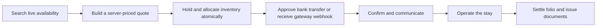

# Client-ready implementation plan

Date: 2026-08-17  
Audience: product, engineering, operations, and client UAT  
Companion audit: [Client-readiness implementation gap map](client-readiness-implementation-gap-map.md)

## Outcome and decisions

The implementation plan exists now. The first release target is one closed, demonstrable lodge journey:



The order of work is deliberate:

1. Finish the staff reservation composer and the manual bank-transfer loop.
2. Make reservation changes, communications, documents, and authenticated acceptance tests complete.
3. Add one online gateway only after the client selects a provider that can onboard the lodge and settle the required currencies.
4. Add direct web booking, channel management, and accounting integrations only when their complete operational loops are in scope.

The Laravel application remains the source of truth for reservations, inventory, prices, deposits, payments, folios, tasks, and guest communications. Calendar, table, chart, mail-editor, gateway, and ERP packages may provide UI or transport capabilities; none may bypass the existing tenant policies and domain services.

## Implementation status — 2026-08-17

The immediate PR-00 through PR-03 milestone is implemented and verified:

- PR-00: deterministic single-lodge fixture, authenticated Playwright harness, and the [client UAT ledger](client-uat-ledger.md).
- PR-01: rate plans/rules, taxes, deposit/cancellation policies, live availability, immutable quotes, and locked quote commit.
- PR-02: availability-first staff composer, inline/repeat guests and companions, server-only totals, atomic hold/allocation, policy-driven deposits, and a reservation hub for allocations, money, tasks, communications, documents, notes, and history.
- PR-03: guest transfer metadata and scan hook, authorized private evidence access, finance review actions, and idempotent payment/folio/deposit reconciliation.

The PostgreSQL Compose fixture passes the authenticated staff journeys, and the direct visual pass covers the reservation composer, reservation hub, and transfer-evidence queue. PR-04 and later remain follow-on work; PR-08 cannot begin until the client selects a merchant provider and sandbox account.

### Payment decision

- **Manual bank transfer is the first production payment method.** It is already the client's stated workflow, and most of its domain foundation exists. The missing review and reconciliation loop is small enough to finish without introducing a second platform.
- **Frappe Payments is not a good primary payment engine for Inn.** It is a Frappe/Python application that expects Frappe DocTypes, web forms, and ERP-style payment requests. Running it beside Laravel would introduce another runtime and a distributed transaction boundary without solving the Inn reservation workflow. Its official repository is active and MIT-licensed, but current open issues include provider-success/accounting-finalization gaps. Frappe or ERPNext can remain a later accounting destination, not the payment authority.
- **Laravel Cashier is optional, not the Inn payment domain.** Cashier 16 supports one-off charges, Payment Intents, refunds, signed Stripe webhooks, and guest Checkout. It is primarily organized around Stripe billable models and subscription billing, while lodge deposits are dynamic, guest-initiated, reservation-scoped, multi-tenant payment attempts. If Stripe is selected, prefer the official Stripe PHP SDK behind the `PaymentGateway` contract; adopt Cashier only if a spike proves that its schema and webhook controller reduce work without leaking Cashier models into the domain.
- **Use provider-hosted checkout.** Inn stores no card number, CVC, or raw payment method. The signed webhook, not the success redirect, is authoritative.

## Client requirement traceability

| Client requirement | Current state | Required implementation | Delivery slice |
| --- | --- | --- | --- |
| 4.1 Unified rooms and activities calendar | Domain-complete custom calendar and projections | Validate resource-lane usability, long stays, colors, buyouts, filters, mobile agenda, and safe actions | PR-04 calendar spike and parity gate |
| 4.2 Guides and operational resources | Domain-complete requirements, capabilities, suggestions, and conflict rules | Complete allocation workbench and authenticated conflict journeys | PR-02 and PR-05 |
| 4.3 Manual reservations, companions, proposals, repeat guests | Client-complete staff hold slice: live availability, immutable quote, atomic allocation, inline/repeat guests and companions | Controlled amendments and later direct-booking exposure | PR-01 and PR-02 complete; PR-05 follow-on |
| 4.4 Emails, triggers, internal notifications | Domain-complete locally for email automation | Production mail provider, delivery/bounce state, resend, template preview, operational failure queue | PR-06 |
| 4.5 50% deposit, balance 30 days, transfer evidence, USD/ARS | Client-complete manual-transfer slice with configurable deposit policy, secure review, and exact-once reconciliation | Hosted gateway and provider reconciliation after selection | PR-03 complete; PR-08 provider-gated |
| 4.6 Revenue, costs, margin, commissions | Domain-complete projections | Verify definitions with client data; implement real authorized exports | PR-07 |
| 4.7 Dietary requirements and kitchen view | Implemented | Authenticated UAT and field-redaction checks | PR-00 and UAT |
| 4.8 Tasks and program checklists | Implemented | Authenticated UAT, exception/retry visibility | PR-00 and PR-06 |
| 4.9 Extras and final account | Implemented domain loop | Closed-stay browser journey, final receipt/invoice, refund corrections | PR-05 and PR-07 |
| 4.10 Post-checkout surveys | Implemented | Production delivery and browser acceptance | PR-06 and UAT |
| 4.11 Admin, sales/ops, guide, kitchen, owner roles | Implemented fixed roles and tenant policies | Retain current authorization; test every new action and file route by role | Every slice |

## Engineering guardrails

Every slice must preserve these existing rules:

- Money is stored in integer minor units with an explicit ISO currency. No floating-point totals and no conversion of core money columns to decimal.
- Reservation and allocation intervals are half-open: `[starts_at, ends_at)`.
- A quote is a calculation result; a confirmed price is an immutable snapshot. A rate edit cannot rewrite an existing reservation.
- Reservation, allocation, deposit, payment, refund, provider-event, document, delivery, and sync states remain separate state machines.
- Money-changing corrections are append-only. A refund is not the same as changing a successful payment row to failed.
- All externally retried commands have an idempotency key and a database uniqueness constraint.
- Inventory decisions are repeated under a database lock at commit time. A UI calendar never decides availability.
- Queued work is dispatched after the database transaction commits.
- Every query and download is tenant-scoped and policy-authorized. Files are private by default.
- Success redirects are informational; signed provider callbacks and reconciliation are authoritative.

## Ordered pull-request plan

Each pull request should remain deployable and should add its own feature, policy, service, API/Filament, and browser evidence. A later pull request may not be used to excuse a broken earlier slice.

### PR-00 — client UAT baseline and authenticated browser harness — implemented

**Purpose:** make “working” mean an executable client journey, not a resource class or passing unit test.

Implement:

- Add a deterministic single-lodge UAT fixture: property, room categories and instances, buyout, programs, guides, vehicles, rate examples, USD/ARS, staff roles, repeat guest, inquiry, proposal, reservation, deposit, tasks, and dietary data.
- Add an authenticated Playwright login/session helper against an isolated database.
- Capture a requirement-ID-to-test-ID ledger for 4.1–4.11.
- Add smoke journeys for every already-implemented area before changing behavior.
- Add a release report that distinguishes passed, failed, scaffold, and explicitly deferred journeys.

Done when:

- A fresh environment can seed the fixture and every role can sign in.
- The existing calendar, kitchen, finance, tasks, guest portal, folio, and survey flows execute without database edits.
- Failing browser journeys block the client-demo build.

### PR-01 — rates, policies, availability query, and immutable quote — implemented

**Purpose:** remove manually calculated reservation totals.

Add records:

- `rate_plans`: property, name, currency, source scope, active dates, occupancy rules, meal/inclusion metadata.
- `rate_rules`: plan, category/program, date or weekday scope, per-night/per-person pricing, min/max stay, closed-to-arrival/departure, stop-sell, priority.
- `tax_rules`: property, jurisdiction label, inclusive/exclusive behavior, percentage or fixed minor amount, active dates.
- `deposit_policies`: fixed/percentage requirements, due offset, confirmation behavior, balance due offset.
- `cancellation_policies` and versioned tiers: cutoff, retained fee, refundable calculation.
- `booking_quotes` and `booking_quote_lines`: inputs, nightly/service/tax breakdown, totals, currency, policy snapshots, expiry, checksum, status.

Add services:

- `AvailabilityQuery` returns categories, exact resources, remaining capacity, blocks, buyout conflicts, and activity capacity for a requested interval.
- `BookingQuoteService` calculates on the server and returns integer-money lines plus selected policy snapshots.
- `CommitBookingQuote` locks the property/inventory, rechecks availability and quote validity, then creates the hold, allocations, folio lines, and deposit requirements in one transaction.

Do not replace `AvailabilityService`; extend or compose it so the existing conflict lock remains the final authority.

Done when:

- The same inputs produce a deterministic quote, including every nightly and tax line.
- Expired or changed availability cannot be committed.
- Two concurrent attempts for the final unit yield one booking and one clear conflict.
- Rate edits do not alter committed reservations.
- USD and ARS test cases reconcile line sums to quote totals exactly.

### PR-02 — staff booking composer and reservation detail hub — implemented

**Purpose:** give sales/operations one usable booking flow.

Build a Filament booking workbench with these steps:

1. Property, dates, adults, children, program, and capability requirements.
2. Available room category or exact room, plus activities and required resources.
3. Rate plan with live nightly/service/tax/deposit/cancellation breakdown.
4. Existing guest search or inline guest creation; companions, language, dietary needs, source/agency, notes.
5. Auto-allocation or explicit allocation.
6. Save draft, hold until a visible expiry, or confirm when the policy permits.

The reservation detail page becomes the operational hub for status/history, guests, allocations, deposits, payments, folio, communications, tasks, documents, and change actions. Borrow eStay's compact live-price interaction and QloApps' complete reservation-workbench content, while keeping Inn services authoritative.

Done when:

- Sales creates a correctly priced and allocated reservation without typing subtotal, tax, or total.
- An inline guest and companions appear in CRM history.
- The hold expires and releases availability exactly once.
- A confirmed reservation provisions the selected deposit policy rather than the current hard-coded 50/50 rule.

### PR-03 — bank-transfer evidence review and reconciliation — implemented

**Purpose:** close the payment workflow the current guest portal already promises.

Extend `guest_payment_evidence` with an enum-backed decision state, guest-declared amount/currency/reference, reviewer note, requested-information note, and optional resulting `payment_id`. Keep the existing hash, storage path, timestamps, and tenant foreign keys.

Add:

- A finance/manager review resource with pending, approved, rejected, and more-information-required saved views.
- Policy-authorized private preview/download routes; never expose `storage_path`.
- File size/type/content validation, malware-scan hook, retention policy, and audit log.
- `ReviewPaymentEvidence` command. Approval locks the evidence and reservation, invokes `PaymentService::recordManual()` with a deterministic evidence idempotency reference, reconciles the selected deposit, and stores the resulting payment. Repeated approval returns the same payment.
- Rejection and information requests create no financial entry and notify the guest.

Done when:

- Guest submits evidence; staff approves it; exactly one payment/folio line appears; the correct deposit is paid; guest balance refreshes.
- A second approval, double-click, queue retry, or API retry creates no duplicate.
- Unauthorized roles and other tenants cannot list or download evidence.

### PR-04 — calendar productization spike

**Purpose:** improve the calendar without handing domain authority to a UI package.

Spike `guava/calendar` on a separate page behind a feature flag. Feed it only from `StaffProjectionService`/calendar projection data. Map rooms, guides, vehicles, horses, boats, and buyouts to resource groups; map stays, activities, tasks, and blocks to distinct event types.

Acceptance gate:

- 7/14/30-day resource views and property-local dates.
- Multi-day stays and same-day checkout/check-in render correctly.
- Program colors, status legend, room grid, buyout visibility, capacity warnings, and lens filters.
- Useful behavior on desktop and a read-only mobile agenda.
- Representative fixture performance with no unbounded relation loading.
- Authorization is preserved for guide, kitchen, sales/ops, owner, and admin roles.
- Drag/drop and resize are disabled initially. If enabled later, they call `MoveReservation` or `ReallocateResource`, show a price/inventory preview, require confirmation and reason, and handle conflicts without silent UI rollback.

Keep the current `MasterCalendar` until Guava passes every parity check. Evaluate Saade FullCalendar only if Guava fails the spike; the resource scheduler path can require a FullCalendar Premium license.

### PR-05 — amendments, moves, cancellation, no-show, and refunds

**Purpose:** make post-booking changes controlled operations instead of unrelated form edits.

Add commands:

- `AmendReservation`: dates, occupancy, services, re-quote, policy snapshot, price delta, payment/deposit adjustment.
- `ReallocateResource`: assign, move, or swap rooms/resources after a locked conflict check.
- `CancelReservation`: reason, policy tier, fee, released inventory, refund requirement, guest communication.
- `MarkNoShow`: separate reason and policy outcome.
- `RequestRefund`/`CompleteRefund`: append-only financial correction with provider state when applicable.

Add a reservation-change record containing before/after snapshots, reason, actor, idempotency key, and resulting financial document IDs.

Done when:

- A room or date change cannot overbook and leaves a readable history.
- Cancellation releases inventory, posts the correct fee/reversal, creates the expected refund requirement, and notifies the guest.
- Check-in and checkout reject invalid or financially/operationally impossible transitions with actionable messages.

### PR-06 — production communications and scheduled operations

**Purpose:** turn the existing template/outbox foundation into a supervised delivery system.

Retain the current `OutboxRecorder`, `DispatchReservationMilestones`, and `CommunicationDeliveryService`. Add:

- A production email transport selected through deployment secrets.
- Sender-domain authentication checklist, reply-to policy, and tenant sender configuration.
- Provider delivery, bounce, complaint, and failure events stored as delivery attempts.
- Resend/replay actions, suppression handling, and an operational failed-delivery queue.
- Template preview, sample data, test send, version diff, and rendering validation.
- Reservation reminder occurrences keyed by tenant, reservation, rule, and target time.

Scheduling rules:

- Keep the scheduler itself in UTC. Resolve the property/tenant timezone when calculating each milestone, then persist `target_at` in UTC.
- Run due-item dispatchers frequently and in bounded batches. Use `onOneServer()` and `withoutOverlapping()` with named locks and expiry.
- Dispatch jobs after commit. Make external-delivery jobs unique or deduplicated, add `WithoutOverlapping` where appropriate, and define timeout, exponential backoff, `retryUntil`, failed-job alerts, and replay.
- Use a shared Redis cache/queue in multi-instance deployments. Add Laravel Horizon for queue wait/throughput visibility once Redis is the production queue; authorize the Horizon dashboard and schedule `horizon:snapshot`.
- Test DST boundaries even though the client timezone may not currently observe DST.

Do not install Fin Mail as a second communication source of truth. Its preview, test-send, merge-tag, version-history, theme, and sent-log UX are good references. A later adapter spike is acceptable only if it operates on Inn `MessageTemplate`, `Communication`, and `DeliveryAttempt` records rather than introducing competing workflow tables.

### PR-07 — documents, invoices, receipts, and real exports

**Purpose:** produce the artifacts the client actually downloads and sends.

Implement:

- A deterministic renderer for confirmation, itinerary, folio, invoice, receipt, credit note, and waiver.
- Jurisdiction-specific invoice numbering and required tax fields configured for the operating entity; do not label a generic folio as a legal tax invoice.
- Immutable artifact storage with template version, source snapshot, checksum, generation status, error, and authorized private download/email actions.
- Queued exports from live filters for arrivals, departures, occupancy, revenue, costs, margin, commissions, payments, deposits, dietary plans, and tasks.
- Export expiry/retention, row count, failure state, requester, tenant scope, and audit.

Use Filament 5's built-in `ExportAction` before buying another export plugin. It already supports queued exports, CSV/XLSX formats, batch naming, queue/backoff customization, and authorization. Explicitly neutralize CSV formula injection for untrusted values because Filament documents that raw values beginning with formula characters are emitted unchanged.

Done when:

- Client downloads and emails a real generated document.
- Finance downloads a filtered export and another tenant/role cannot access it.
- A failed render/export is visible, retryable, and never presented as completed.

### PR-08 — one online gateway, after provider selection

**Purpose:** add a complete payment integration rather than another settings form.

Provider selection gate:

- The client confirms merchant country/legal entity, expected USD/ARS collection, settlement bank/currencies, card-present requirement, refund operations, fees, tax receipt behavior, and acceptable checkout UX.
- A sandbox account and production-onboarding owner exist.

Add records:

- `payment_attempts`: reservation/deposit/folio target, amount, currency, provider, idempotency key, provider session/payment IDs, state, expiry, failure code, metadata.
- `provider_events`: provider event ID, raw-body checksum, type, received/processed timestamps, state, attempt count, error; unique by provider/account/event ID.
- `refunds`: payment, amount, reason, provider reference, state, requested/completed timestamps and actor.
- `settlement_entries`: gross, fees, refunds, net, currency, payout reference/date, reconciliation state.

Adapter surface:

```php
interface PaymentGateway
{
    public function createHostedCheckout(PaymentAttempt $attempt): HostedCheckout;
    public function parseVerifiedEvent(string $rawBody, array $headers): ProviderEventData;
    public function refund(Refund $refund): ProviderRefund;
    public function fetchPayment(string $providerReference): ProviderPayment;
}
```

Processing rules:

- Create attempts with a server-calculated amount and Inn idempotency key.
- Verify the signature against the untouched raw request body, persist/deduplicate the event, return `2xx` promptly, then process asynchronously.
- On confirmed provider success, lock the attempt and call the existing `PaymentService` exactly once. Do not confirm a reservation from the browser return URL.
- Model pending, requires-action, processing, succeeded, failed, canceled, partially-refunded, refunded, and disputed provider states without merging them into reservation status.
- Reconcile payouts separately; checkout success does not prove settlement.
- Contract-test the adapter and run the provider CLI/sandbox for duplicate, reordered, delayed, failed, refund, and signature-invalid events.

Done when:

- A guest pays a deposit in sandbox, duplicate/reordered webhooks create one payment, the balance changes once, a receipt is issued, and partial/full refunds reconcile.

### PR-09 — direct booking engine, conditional scope

**Purpose:** expose the same reservation engine to guests without duplicating inventory or pricing.

Only begin if direct web sales are part of the signed launch scope. Build property/date/guest search, room/program selection, quote and policies, guest details and consent, expiring hold, payment, confirmation, recovery from failed payment, bot/rate limits, and analytics attribution. The public app calls the same `AvailabilityQuery`, `BookingQuoteService`, and `CommitBookingQuote` used by staff.

Do not require a user account before showing availability. Require authentication or a secure reservation token only where the client needs trip management or sensitive data.

### PR-10 — one accounting or channel integration at a time

**Purpose:** avoid many shallow “connected” badges.

For accounting, begin with an immutable downloadable package unless the client requires live API sync. Include customer, invoice/credit/payment journal, tax, currency, cost-center mappings, external IDs, period locks, retry, and reconciliation.

For an OTA/channel manager, require property/room/rate mapping, availability/rates/restrictions push, reservation create/change/cancel import, cursor, deduplication, retry/dead letter, replay, connection health, last success, and inventory reconciliation. The existing iCalendar feed remains a low-fidelity availability feed and must not be marketed as a channel manager.

## Filament plugin decision register

| Package | Decision | Reason and boundary |
| --- | --- | --- |
| [Guava Calendar](https://filamentphp.com/plugins/guava-calendar) | **Spike now** | Filament 5/Laravel 13 compatible, MIT, supports multiple event models and grouped resources. It may replace only the calendar rendering layer after the PR-04 parity gate. |
| [Saade FullCalendar](https://filamentphp.com/plugins/saade-fullcalendar) | **Fallback spike** | Mature interaction model and Filament 5 support, but current Laravel 13 resolution needs verification and resource scheduler features may require FullCalendar Premium. |
| [Shield](https://filamentphp.com/plugins/bezhansalleh-shield) | **Do not adopt now** | Inn already has tenant-aware memberships, fixed client roles, policies, and tests. A second permission authority adds migration and semantic risk. Revisit only for client-editable custom roles. |
| [Advanced Tables](https://filamentphp.com/plugins/kenneth-sese-advanced-tables) | **P1, license-gated** | Saved views, quick filters, multi-sort, and user/preset views fit arrivals, reservations, housekeeping, and exceptions. Add only after core queries are correct and private Composer credentials/licensing are approved. |
| [Spatie Media Library](https://filamentphp.com/plugins/filament-spatie-media-library) | **P1 for public property media** | Good for room/property galleries. Do not migrate evidence, identity documents, invoices, or waivers to its default upload path; private storage is not supported out of the box without explicit bucket/visibility design. |
| Activity Log packages | **Skip** | Inn already has `TenantAuditObserver` and domain histories. Build a read-only Filament audit viewer over existing audits instead of recording every action twice. |
| [Fin Mail](https://filamentphp.com/plugins/finity-labs-fin-mail) | **UX reference; no install now** | Strong editor/preview/test-send/version/log concepts and current Laravel 13/Filament 5 support, but it duplicates current message templates and communication logs. |
| [Language Switch](https://filamentphp.com/plugins/bezhansalleh-language-switch) | **P1 after translations exist** | Low-risk staff locale switch. It does not translate stored guest content, public pages, documents, or messages, so it is not the localization implementation by itself. |
| [Apex Charts](https://filamentphp.com/plugins/leandrocfe-apex-charts) | **P2 polish** | Useful range bars and heatmaps after KPI definitions are validated. Existing native widgets are sufficient for launch; chart code may never become the metric source. |
| [StateFusion](https://filamentphp.com/plugins/assem-alwaseai-statefusion) | **Reject** | It would replace tested enum/service transitions with a second state framework, and current Laravel 13 compatibility is not established. |
| Google Maps packages | **Defer** | The client needs coordinates, transfer notes, and a guest map link, not a mapping subsystem. Plain lat/lng plus an external map link is enough; spike a maintained Filament 5/Laravel 13 field only if staff map editing becomes necessary. |
| [Custom Dashboards](https://filamentphp.com/custom-dashboards-plugin) | **P2, license-gated** | Excellent self-service analytics, but unnecessary before the fixed owner/finance KPIs and tenant-sharing rules are validated. |
| [Athena](https://filamentphp.com/plugins/lara-zeus-athena) | **Reject for core** | Appointment timeslots would duplicate Inn programs, service occurrences, resources, allocations, and capacity rules. |
| [Business Hours](https://filamentphp.com/plugins/andreia-bohner-business-hours) | **Defer** | Useful for restaurant/spa opening hours, not room inventory. It is premium and would add another availability model. |
| Advanced Roster | **P2 only** | Staff shift scheduling is outside client requirements 4.1–4.11. Resource assignment and guide availability remain native. |
| Filament Analytics reporting templates | **Reject** | The linked site is a separate reporting product/template catalog, not a Inn runtime dependency. |

Before installing any third-party package, run a dependency-resolution spike against the locked PHP 8.3, Laravel 13, Filament 5, Livewire, and PostgreSQL stack; inspect migrations and authorization; record license and abandonment risk; and prove uninstall/rollback on a disposable database.

## What to reuse from the references

| Source | Reuse | Do not reuse |
| --- | --- | --- |
| [AureusERP](https://github.com/aureuserp/aureuserp) | MIT-licensed small Filament patterns: modular resource organization, translated labels, transactional confirmation actions, query-builder filters, export actions, payment list/grouping, plugin dependency declarations | Its broad ERP module graph, accounting state as reservation state, decimal money, or its skeletal payment transaction model as a gateway. Its payments package has no Stripe/webhook implementation. |
| [QloApps](https://github.com/Qloapps/QloApps) | Workflow ideas: availability before booking, booking cart/workbench, auto/manual allocation, room move/swap, advance-payment rules, reservation detail hub, channel mapping/health | Literal source snippets. QloApps uses OSL 3.0 and a legacy hotel/order architecture; treat it as an interaction oracle, not a code donor. |
| [eStay admin/public demo](https://estay.wrteam.me/) | Interaction ideas confirmed in a real read-only browser journey: add-booking modal with live price summary; booking detail page; payments table/detail timeline; today check-in/out worklists; room-grid availability; separate gateway configuration; public search/property/policy flow | Code, hidden APIs, credentials, mobile-app scope, or its gateway list as proof that a provider works for this client. The demo is evidence of UX only. |
| Filament packages | Install through Composer and use their public extension points after compatibility/security review | Copying vendor internals into the application or allowing a widget action to mutate inventory directly. |

If an AureusERP snippet is copied literally, keep it small, retain its MIT attribution in `THIRD_PARTY_NOTICES.md`, link the source commit/path in the code comment, rewrite it to Inn tenant and integer-money rules, and cover it with Inn tests. Otherwise, reimplement the idea cleanly.

Concrete study list:

- AureusERP [transactional payment confirmation action](https://github.com/aureuserp/aureuserp/blob/master/plugins/webkul/accounts/src/Filament/Resources/PaymentResource/Actions/ConfirmAction.php): useful `requiresConfirmation()`/`databaseTransaction()`/failure-notification shape; replace its accounting calls with one Inn application command.
- AureusERP [payments table](https://github.com/aureuserp/aureuserp/blob/master/plugins/webkul/accounts/src/Filament/Resources/PaymentResource/Tables/PaymentsTable.php): useful grouping, query-builder filters, money columns, status badges, and built-in export action.
- AureusERP [maintenance calendar widget](https://github.com/aureuserp/aureuserp/blob/master/plugins/webkul/maintenance/src/Filament/Widgets/MaintenanceCalendarWidget.php): useful bounded event fetch and modal/view organization; do not copy its direct model mutation for Inn inventory.
- QloApps [Book Now](https://docs.qloapps.com/hrs/book_now/), [order operations](https://docs.qloapps.com/orders/orders/), [room pricing and advance payment](https://docs.qloapps.com/catalog/manage_room_types/), and [channel manager](https://docs.qloapps.com/channel_manager/) documentation: use these to write UAT scenarios, not as source-code donors.

## Laravel implementation checklist

Use these current primary references while building:

- [Laravel 13 Cashier / billing](https://laravel.com/docs/13.x/billing): one-off charges, guest checkout, refunds, webhooks, signatures, and lowest-denomination amounts.
- [Laravel 13 queues](https://laravel.com/docs/13.x/queues): after-commit dispatch, unique jobs, overlap middleware, throttled exceptions, retry windows, failed jobs, and batches.
- [Laravel 13 scheduling](https://laravel.com/docs/13.x/scheduling): `withoutOverlapping`, `onOneServer`, named locks, groups, and timezone/DST cautions.
- [Laravel 13 events](https://laravel.com/docs/13.x/events): queued listeners and dispatch after database commit.
- [Laravel 13 cache locks](https://laravel.com/docs/13.x/cache#atomic-locks): distributed locks require a shared central cache across servers.
- [Laravel 13 Horizon](https://laravel.com/docs/13.x/horizon): Redis queue supervision, wait thresholds, throughput, and snapshots.
- [Filament 5 exports](https://filamentphp.com/docs/5.x/actions/export): queued CSV/XLSX exports, job/batch customization, authorization, and formula-injection warning.
- [Stripe webhooks](https://docs.stripe.com/webhooks): raw-body signature verification, fast `2xx`, asynchronous processing, and CLI testing if Stripe is selected.

## Release gates

The implementation is client-ready only when all gates pass in a production-like environment:

1. Sales creates a live-priced, conflict-free reservation without typing totals.
2. Guest transfer evidence is approved into exactly one payment, or the selected gateway sandbox creates exactly one payment from signed duplicate/reordered events.
3. Confirmation provisions the configured deposits, sends a visible communication, and updates the guest portal.
4. Staff moves/amends/cancels without overbooking; fees and refunds are traceable.
5. Guide, kitchen, housekeeping, sales/ops, owner, and admin see only their authorized records and fields.
6. Check-in, tasks, extras, checkout, folio closure, survey, invoice/receipt, and reports execute through the UI.
7. Queue, scheduler, failed jobs, delivery failures, provider events, and integration health are supervised and replayable.
8. Private files cannot be guessed or accessed across roles/tenants.
9. Backup and restore are rehearsed; secrets, workers, scheduler, object storage, monitoring, retention, and runbooks are documented.
10. Anything not passing is labeled deferred or scaffold and is not shown to the client as implemented.

## Immediate starting order

Start with `PR-00`, then `PR-01`, `PR-02`, and `PR-03`. Those four slices turn the current strong domain demo into a usable reservation plus bank-transfer product. Run the Guava calendar spike in `PR-04` without blocking the booking/payment core. Do not begin Frappe Payments, a channel manager, self-service dashboards, or multiple gateway adapters before that loop passes authenticated UAT.
