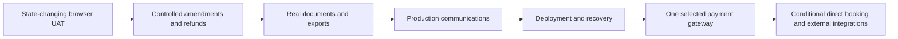

# Client-ready phase 2 plan

Date: 2026-08-17; status updated 2026-08-18  
Audience: product, engineering, operations, and client UAT  
Previous plan: [Client-ready implementation plan](client-ready-implementation-plan.md)

> N2 is implemented and independently verified. The remaining work, including N2.1 hardening and the incomplete N1 client journeys, is now tracked in the [phase 3 implementation plan](client-ready-phase-3-plan.md).

## Outcome

PR-00 through PR-03 and phase 2 N2 are implemented. Inn now has a real server-priced staff booking flow, atomic holds and allocations, configurable rate/tax/deposit/cancellation policy snapshots, a reservation hub, an idempotent manual bank-transfer review service, and guarded append-only amendments, room changes, cancellation/no-show fees, and internal refunds.

The next phase is not another breadth pass. It is the work required to turn those foundations into a defensible client demo and then a production handoff:

## Verified baseline

The 2026-08-18 re-verification established:

- `make doctor` passes with healthy API, public web, PostgreSQL, Redis, Mailpit, worker, and scheduler services.
- 224 PHPUnit tests pass with 1,548 assertions.
- Five authenticated Playwright tests pass: four route/render smoke tests and one real N2 mutation journey.
- The live reservation composer exposes availability, an immutable server quote, guest details, and no editable totals.
- The live native calendar exposes week, two-week, and 30-day views; place/asset/crew lanes; buyouts; program colors; filters; allocation health; agenda; and utilization.
- The reservation hub exposes allocations, deposits, payments, folio, tasks, communications, documents, notes, and history.

The N2 browser test creates and confirms a reservation, amends the stay, moves the room, records and reconciles payment, applies a 50% cancellation fee, completes the internal refund, and verifies a zero balance and readable change ledger. The remaining four authenticated tests still assert route/render state only. Guest evidence approval, check-in/extra/checkout/folio close, survey response, document download, roles, and mobile remain incomplete closed-loop UAT.

## Remaining gap map

| Capability | Honest current state | Gap that remains | Client-demo gate |
| --- | --- | --- | --- |
| Staff reservation | Domain and Filament composer implemented | No state-changing browser journey proves quote → hold → confirm → persisted totals/allocations | Browser creates and confirms a reservation and verifies the resulting hub and calendar |
| Native master calendar | Strong productized implementation | Authenticated mobile, role, performance, and safe-action acceptance are incomplete | Keep the native calendar; pass mobile/role/performance checks without installing another calendar package |
| Manual bank transfer | Review service, private download, states, and exact-once reconciliation implemented | Browser suite only opens the queue; fixture currently shows no evidence to review | Guest submits evidence; finance approves it; one payment/folio effect appears and the deposit/balance updates once |
| Reservation changes | Guarded amendment, room assignment/move/swap, priced cancellation/no-show, internal partial/full refund retry/completion, and append-only change ledger are implemented and browser-proven | Property-local cutoff and partial-refund/payment-reversal collision hardening; provider-backed execution remains separate | P3-01 invariant matrix passes, then provider refund passes under P3-06 |
| Pricing authority | Reservation creation and amendment are quote-authoritative | Extend adversarial/API replay coverage and keep all future public/provider flows on the same quote services | Client-supplied totals fail and every committed amount reconciles to immutable quote lines |
| Reservation UI polish | Confirmed Edit dead end removed; guarded actions live in the hub | Complete the remaining closed-loop role/mobile/error-state acceptance | No visible dead-end action or contradictory label in every release journey |
| Documents | Immutable template/document records exist | `DocumentService` stores supplied bytes with a `.pdf` name; no deterministic PDF renderer, issuance command, authorized download/email loop, or legal invoice configuration | Generate, download, and email a real confirmation, invoice/folio, and receipt |
| Report exports | Export records and safe CSV helper exist | The Filament resource cannot create an export and no queued generator/download lifecycle exists | Finance requests and downloads a filtered CSV/XLSX; cross-tenant/role access fails |
| Communications | Local email delivery, templates, automations, attempts, worker, and scheduler exist | No production provider events, bounce/complaint handling, replay queue, test-send/preview workflow, or supervised failure view | Confirmation/reminder sends through the selected provider and failures are visible/retryable |
| Online payment | No gateway domain or provider adapter | No attempts, verified provider events, hosted checkout, refunds, disputes, receipts, or settlement reconciliation | Provider-gated sandbox journey creates one payment from duplicate/reordered callbacks |
| Direct booking | Public app is marketing only | No public availability, quote, hold, guest consent, payment, or recovery flow | Conditional on signed scope; uses the same booking services as staff |
| Accounting/channel integrations | Configuration records only | No mappings, sync engine, cursors, deduplication, replay, health, or reconciliation | Implement one selected accounting export/API or channel connection end to end |
| Production operations | Compose runtime is healthy | No production runbook, managed storage/database proof, backup/restore rehearsal, monitoring/alerts, retention/privacy procedure, or external malware scanner | Deploy, restore, observe, and hand over from documented procedures |

## Ordered execution plan

### N1 — release truth and real closed-loop browser UAT

Replace the current route-only client smoke suite with deterministic, state-changing journeys against an isolated PostgreSQL fixture.

Implement and prove:

1. Sales selects dates/category/rate, receives a server quote, creates a hold, confirms it, and sees its allocation and price snapshot in the hub and calendar.
2. A guest opens a secure portal link, completes pre-arrival details, and uploads declared transfer evidence.
3. Finance previews the private evidence, approves it, and sees exactly one payment, folio entry, reconciled deposit, and refreshed guest balance.
4. Staff checks in, posts an extra, checks out, closes the folio, and verifies housekeeping/task/survey effects.
5. Duplicate approval and repeated submissions remain idempotent.
6. The same critical surfaces are checked under each relevant role and at a phone-sized viewport.

Also fix the confirmed-reservation Edit dead end, guest/companion wording, seed data needed for a meaningful demo, and the public "Auditable exports and reconciliation" claim until N3 actually ships it.

Done when `make test-client` proves mutations and resulting state, not only page availability.

### N2 — guarded amendments, moves, cancellation, and refunds — implemented 2026-08-18

Create explicit application commands and one append-only `reservation_changes` record:

- `AmendReservation`: dates, occupancy, services, new quote, policy snapshots, price delta, deposit/payment effects.
- `ReallocateResource`: assign, move, or swap after a locked conflict check.
- `CancelReservation` and `MarkNoShow`: reason, applicable policy tier, fee, inventory release, communication, and refund requirement.
- `RequestRefund` and `CompleteRefund`: partial/full append-only refund states, references, failure/retry, and resulting folio/receipt records.

Remove client-supplied totals from the generic reservation create/update API. A booking must be committed from a valid quote; an amendment must be priced by the amendment command.

Done when browser journeys prove a date change, room move, cancellation fee, and refund without overbooking, duplicate money, or mutable financial history.

### N3 — real documents, invoices, receipts, and exports

Implement:

- Deterministic rendering for confirmation, itinerary, folio, invoice, receipt, credit note, and waiver.
- Legal invoice numbering/tax fields only after the operating jurisdiction and entity are confirmed.
- Immutable source snapshot, template version, checksum, generation/error state, and authorized private download/email actions.
- Queued filtered CSV/XLSX exports for arrivals, departures, occupancy, revenue, costs, margin, commissions, payments, deposits, dietary plans, and tasks.
- Export expiry, row count, requester, failure/retry, audit, and CSV formula neutralization.

Use Filament's built-in export actions before adding a reporting plugin.

Done when the client downloads and emails a real document and finance downloads a real filtered export.

### N4 — production communications and scheduled operations

Choose one production mail provider and add:

- Tenant sender/reply-to settings and deployment-secret references.
- Provider message IDs plus delivery, bounce, complaint, and failure events.
- Preview, sample rendering, test send, resend/replay, suppression, and a failed-delivery work queue.
- Unique/overlap-safe jobs, explicit timeout/backoff/retry windows, failed-job alerts, and bounded scheduling.
- Property-timezone milestone calculation persisted as UTC, including boundary tests.
- Horizon or equivalent Redis queue supervision in production.

Mailpit remains the local demo transport; it is not production delivery evidence.

### N5 — production deployment, private storage, and recovery

Before client production use:

- Select managed PostgreSQL, Redis, private object storage, secret storage, TLS termination, and hosting.
- Store uploads/documents outside the application container with authorized access and retention/deletion rules.
- Configure a real malware scanning service for guest evidence.
- Add monitoring, alerts, structured log retention, queue/scheduler health, and failure dashboards.
- Rehearse backup and restore, record recovery objectives, and write deploy/rollback/incident/privacy runbooks.
- Run the closed-loop UAT against the production-like deployment.

### N6 — one online payment gateway, provider-gated

Do not implement this slice until the client confirms merchant country/legal entity, USD/ARS charging and settlement requirements, bank accounts, card-present needs, refund operations, fees, and sandbox ownership.

Keep Laravel as payment authority. Add `payment_attempts`, `provider_events`, `refunds`, and `settlement_entries`; use hosted checkout; verify raw-body signatures; deduplicate callbacks; process asynchronously; and call the existing `PaymentService` exactly once after confirmed provider success.

Frappe Payments remains out of scope as the primary engine. It would add a second runtime and transaction boundary without replacing the Inn reservation/payment domain.

### N7 — conditional growth integrations

Only after N1–N6 or an explicit launch deferral:

- Direct booking engine if the signed scope includes self-service sales.
- One accounting export/API selected by the client.
- One OTA/channel manager selected by the client.
- SMS/WhatsApp, e-signature, maps, language switching, saved table views, or advanced analytics only when tied to a named operational requirement.

## Calendar and plugin decision

Do **not** install Guava Calendar merely because it appeared in the first plan. The current native calendar already demonstrates most of the required product behavior and keeps reservation authority inside Inn. Close its mobile, role, performance, and action acceptance gaps first. A plugin spike becomes justified only if a named interaction cannot be delivered safely with the native calendar.

Likewise:

- Keep existing policies instead of adding Shield.
- Keep existing audits instead of adding another activity-log authority.
- Use Filament native exports before buying reporting templates.
- Add language switching only after real translations exist.
- Treat Apex Charts and custom dashboards as polish, not launch dependencies.

## Client decisions required before provider work

The implementation can continue through N1–N3 without these decisions. N4–N7 require the client to confirm:

1. Operating legal entity and invoice/tax jurisdiction.
2. Merchant country, charge currencies, settlement currencies/banks, and preferred gateway.
3. Production email domain and provider.
4. Whether guests must book directly at launch.
5. Required accounting system and whether file export is acceptable initially.
6. Required OTA/channel manager, if any.
7. Production hosting, object-storage region, retention, privacy, backup, and recovery requirements.

## Release boundaries

### Safe client demonstration

The staff-booked/manual-transfer product is safe to demonstrate after N1 and the relevant N2/N3 journeys pass. Online payment, legal invoices, exports, and external integrations must be labeled unavailable until their complete loops pass.

### Production handoff

Production requires N1–N5 plus either a completed N6 gateway or an explicit signed manual-transfer-only launch decision. Every deferred capability must remain absent from marketing claims and client UAT scripts.
