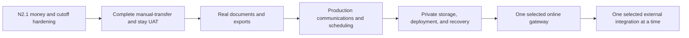

# Client-ready phase 3 implementation plan

Date: 2026-08-18  
Inputs: [Rincón Grande requirements](rincon-grande-requirements.md), [phase 2 plan](client-ready-phase-2-plan.md), [reference benchmark](reference-code-quality-benchmark.md), [UAT ledger](client-uat-ledger.md)

## Current release truth

N2 is implemented and independently re-verified:

- 224 PHPUnit tests and 1,548 assertions pass.
- Five authenticated Playwright tests pass, including create → confirm → amend → move → reconcile full payment → apply 50% cancellation fee → complete refund → reach a zero balance.
- Pint, PHPStan, ESLint, TypeScript, OpenAPI verification, Docker/runtime health, and the authenticated client suite pass.
- Reservation creation is quote-authoritative and guarded changes are append-only, policy-authorized, conflict checked, and idempotent at their command endpoints.

This does **not** finish the client product. The remaining critical path is:

## Gap register

| Area | What is real now | Remaining implementation gap |
| --- | --- | --- |
| N2 guarded changes | Date amendment, room assignment/move/swap, cancellation/no-show fee, internal refund request/fail/complete, change ledger, API/Filament/browser evidence | Property-local cancellation cutoff tests; partial-refund versus legacy full payment reversal protection; concurrent API replay/failure matrix; broader amendment/deposit/activity/no-show cases; provider refund execution remains separate |
| Client closed loop | State-changing staff create/confirm/change/payment/cancel/refund journey | Guest portal pre-arrival/evidence → finance approval, check-in → extra → checkout → folio close → survey, multi-role/mobile journey, and meaningful fixture assertions |
| Manual payments | Exact-once evidence approval and manual payment reconciliation services | Browser evidence loop, manual-payment method truth, over/underpayment allocation rules, cash controls/receipts if cash is in scope, production scanning/storage/retention |
| Documents | Versioned template and immutable generated-document records | Real PDF rendering, source snapshots, lifecycle/error state, private download/email, confirmation/itinerary/folio/receipt/credit-note outputs, jurisdiction-gated invoice issuance |
| Exports | Export record model and CSV formula sanitizer | Request/generate/download lifecycle, filtered CSV/XLSX, queue/retry/expiry, tenant/role scoping, reconciliation tests |
| Communications | Local Laravel email transport, templates, suppressions, delivery attempts, outbox, worker, scheduler | Production provider, provider message/event IDs, delivery/bounce/complaint webhooks, preview/test-send/replay UI, failure queue, production supervision |
| Scheduling | UTC scheduler with `withoutOverlapping()` and `onOneServer()` | Named lock TTLs, target occurrences persisted in UTC, property-local boundary and DST tests, backoff/timeouts/failed-job alerts, Horizon or equivalent production supervision |
| Production | Healthy Compose stack | Private object storage, managed data services, secrets, TLS, monitoring, alerting, logs, malware service, backup/restore rehearsal, rollback/incident/privacy runbooks |
| Online gateway | No provider transaction model or execution | Provider choice, hosted checkout, attempts/events/refunds/settlements, raw-body signature verification, duplicate/reordered callback handling, disputes, receipts, payout reconciliation |
| Direct booking | Public marketing site only | Conditional public availability/quote/hold/consent/payment/recovery flow using the same Inn services |
| Integrations | Configuration records, local mail, and one-way private iCalendar | Adapter execution, sync runs/items/cursors, mappings, signed webhooks, retry/dead letter/replay, health, drift detection, reconciliation for each selected provider |

## Ordered implementation slices

### P3-01 — N2.1 financial and temporal hardening

Close the two observed correctness collisions before building more financial features:

- Calculate cancellation tiers from the property's local calendar day, while persisting instants in UTC. Add before/at/after cutoff and DST/non-DST data sets.
- Prevent legacy full payment reversal after any completed or open partial refund unless a dedicated correction command computes and validates the remaining reversible amount.
- Give manual and provider payments explicit origins so a staff-entered `card` row cannot be mistaken for a captured online card payment. Until a gateway exists, label it as an externally processed/manual record or hide it.
- Test concurrent refund requests/completions/reversals, no-show tiers, full versus partial payments, overpayment credit, amendment price increases/decreases, paid/open deposit rescheduling, retained activities, expired quotes, checked-in move/swap housekeeping, and transaction rollback after conflict.
- Add API-level idempotency replay assertions for every N2 command, not only direct service exact-once assertions.

Done when every invariant has a PostgreSQL test and the N2 Playwright journey still passes.

### P3-02 — finish N1 closed-loop client UAT

Add deterministic, state-changing authenticated journeys:

1. Staff creates and confirms a priced reservation and verifies allocation/price snapshots in the hub and calendar.
2. Guest opens a secure link, completes pre-arrival data, accepts required documents, and uploads transfer evidence.
3. Finance previews the private evidence, requests more information or rejects without financial mutation, then approves a valid submission exactly once and sees the deposit/balance update.
4. Operations checks in, posts an extra, completes tasks/housekeeping, checks out, settles and closes the folio.
5. The survey invitation and guest response become visible to authorized staff.
6. Role-denied actions, cross-tenant IDs, expired guest links, duplicate submits, and a phone viewport are exercised.

Do not delete synthetic UAT financial/history rows to make reruns look clean. Use unique run identifiers, normal lifecycle cleanup, and bounded data-retention tooling.

### P3-03 — real documents, receipts, credit notes, and exports

Build on the existing models without pretending supplied bytes are rendered PDFs:

- Introduce document generation requests/jobs with `pending`, `processing`, `generated`, and `failed` states; immutable source snapshot, template version, locale, checksum, renderer version, attempt/error, retention/expiry, and replacement linkage.
- Render reservation confirmation, itinerary, folio statement, payment receipt, refund receipt/credit note, and waiver first. Add a legal invoice only after entity, jurisdiction, numbering, tax fields, and cancellation/credit-note rules are approved.
- Store artifacts on a private configurable disk; authorize every download and email action; never display raw storage paths as the user workflow.
- Use Filament 5 native queued CSV/XLSX exports where it fits. Explicitly tenant-scope export queries because Filament does not apply per-record policies automatically, and sanitize formula-leading untrusted values.
- Ship arrivals, departures, occupancy, revenue, payments/deposits/refunds, costs/margin/commissions, dietary, and task exports with row counts, filters, requester, expiry, failure/retry, and audit.

Acceptance includes byte/header validation, deterministic snapshot/checksum tests, concurrent legal-number allocation when enabled, template failure/retry, cross-tenant/role download denial, and a browser download/open journey.

### P3-04 — production communications and scheduler supervision

- Select one production email provider; keep Mailpit local only.
- Store provider IDs and immutable delivery events for accepted, delivered, delayed, bounced, complained, rejected, and failed outcomes.
- Verify inbound provider signatures and deduplicate/replay events.
- Add template preview with fixture data, validation, test send, resend/replay, suppression, and failed-delivery work queues.
- Calculate each property-local milestone once, persist `target_at` in UTC, dispatch due occurrences in bounded batches, and make the occurrence key unique.
- Use named `withoutOverlapping()` locks with explicit expiry and `onOneServer()`. Jobs define queue, timeout, attempts, backoff, `retryUntil`, after-commit behavior, and terminal failure reporting.
- Supervise Redis queues with Horizon or an equivalent production service and alert on wait time, failed jobs, scheduler silence, and delivery failures.

Follow the current [Laravel 13 queue](https://laravel.com/docs/13.x/queues) and [scheduling](https://laravel.com/docs/13.x/scheduling) semantics; avoid timezone-scheduled cron expressions because DST can skip or duplicate executions.

### P3-05 — production storage, deployment, security, and recovery

- Select managed PostgreSQL, Redis, private object storage, secret manager, TLS/hosting, and regions.
- Enforce MIME/content/size checks, malware scanning, quarantine, signed/authorized downloads, retention, deletion, and privacy export procedures.
- Add structured logs and metrics for HTTP, queue, schedule, provider event, integration sync, storage, and database health without leaking secrets or guest documents.
- Rehearse database and object restore together; record RPO/RTO and evidence. Test deploy, migration rollback strategy, application rollback, worker restart, key rotation, incident handling, and disaster recovery.
- Run the complete state-changing UAT against a production-like deployment and produce a handoff checklist.

### P3-06 — one provider-backed online payment integration

This starts only when the client confirms merchant legal entity/country, USD/ARS charging, settlement currencies/accounts, card-present needs, fees, tax-receipt behavior, sandbox owner, and refund/dispute operations.

Keep Inn authoritative and add:

- `payment_attempts`, `provider_events`, provider-backed `refunds`, and `settlement_entries` with unique provider/account/event and idempotency constraints.
- A `PaymentGateway` adapter for hosted checkout creation, verified raw-body event parsing, payment lookup, and refund execution.
- Authoritative asynchronous webhook processing; redirects are informational only.
- Provider state separate from Inn payment, reservation, deposit, folio, refund, and settlement states.
- Partial/full refunds, failed refund retry, disputes/chargebacks, fees, payouts, manual reconciliation, and mismatch work queues.

Laravel Cashier is an optional Stripe implementation aid, not the domain. Its current documentation supports guest/single-charge Checkout and signed webhook handling, but its subscription/billable schema must not leak into reservation accounting. Frappe Payments remains a reference, not a runtime dependency.

Acceptance replays invalid signatures, duplicates, reordering, delayed success, success-after-timeout, amount/currency mismatch, requires-action, failure, refund, dispute, and payout mismatch. Exactly one Inn payment/folio effect may result from a successful provider transaction.

### P3-07 — direct booking, conditional on signed scope

Expose guest-safe search, quote, policy, consent, expiring hold, selected payment/manual instructions, confirmation, and failed-payment recovery through the same `AvailabilityQuery`, `BookingQuoteService`, and commit/change services. Add rate limiting, bot defense, analytics attribution, accessibility, locale, privacy, and abandoned-hold cleanup. Do not build a second public pricing or inventory engine.

### P3-08 — integration execution platform and first connector

Extend `integration_connections` with provider/account/environment identity and add `integration_sync_runs`, `integration_sync_items`, mappings, cursors, external IDs, attempts, errors, and reconciliation state. Every connector must expose test connection, last success, lag, mapping errors, retry/dead letter, manual replay, disable/revoke, and health.

Implement exactly one client-selected outcome first:

- accounting: immutable export package or one API with chart/tax/payment/currency/cost-center mappings, period locks, correction, and reconciliation; or
- OTA/channel manager: property/room/rate mapping, ARI push, reservation create/change/cancel import, cursor/deduplication, drift detection, and inventory reconciliation; or
- SMS/WhatsApp/e-signature only when a named legal/operational journey and consent model require it.

The existing private iCalendar feed remains a one-way availability feed, never a channel-manager claim.

## Edge-case and test strategy

There is no finite list of “all infinite edge cases.” The release strategy is to define invariants, enumerate failure classes, and generate/replay representative cases at every boundary.

| Risk class | Required coverage |
| --- | --- |
| Money | zero/min/max amounts, rounding, partial/multiple/overpayment, currency mismatch, price decrease/increase, open/completed refunds, reversal collisions, fees, disputes, settlement variance |
| Inventory/time | half-open boundaries, same-day turnover, long stays, buyouts, capacity >1, holds expiring during commit, concurrent final-unit booking, property timezone, leap day, DST, clock skew |
| External events | invalid signature, duplicate/reordered/delayed events, provider timeout after remote success, 429/5xx, poison event, key rotation, replay, provider fetch disagreement |
| Files/documents | wrong MIME/content, oversized/malicious upload, checksum mismatch, renderer crash, missing template/font/image, concurrent numbering, expired URL, unauthorized tenant/role |
| Queues/schedules | dispatch before rollback, duplicate workers, overlap-lock expiry, worker kill, retry exhaustion, stale job/model, dead letter, scheduler silence, daylight-boundary occurrence |
| Authorization/privacy | direct object reference, property scope, field redaction, export query leakage, signed link replay, revoked staff/guest access, secret/log leakage |
| Operations | empty and high-volume fixtures, mobile viewport, accessibility, slow queries/N+1, backup with missing object, restore, rolling deploy, rollback, provider outage |

Each slice must include unit/data-provider tests, PostgreSQL transaction/concurrency tests, policy/tenant tests, API/OpenAPI tests, queue/provider contract fixtures, and a state-changing Playwright journey. Production-like UAT and restore evidence remain release gates; mocks alone are insufficient.

## Per-slice definition of done

A slice is complete only when:

1. its requirement IDs and deferred decisions are explicit;
2. schema constraints and state transitions enforce the invariant, not only the UI;
3. every mutation is policy-authorized, tenant-scoped, audited, and retry-safe;
4. success, validation, conflict, timeout, retry, and terminal-failure paths are tested;
5. OpenAPI, Filament/portal UX, jobs/schedules, monitoring, and runbook changes ship together when applicable;
6. a real browser/provider/deployment journey proves the client outcome;
7. Pint, PHPStan, PHPUnit/PostgreSQL, ESLint, TypeScript, builds, contract checks, dependency audits, Docker smoke, and `git diff --check` pass;
8. status documents and marketing claims are updated to match executable reality.

## Immediate next action

Implement **P3-01**, then **P3-02**, then **P3-03**. That order protects N2 money correctness, closes the original Rincón Grande manual-transfer/stay promise, and produces the documents/exports the client needs to see. Provider selection can proceed in parallel as a business decision, but P3-06 code must not start against an unconfirmed merchant/provider model.
