# Client-ready phase 3 implementation plan

Date: 2026-08-18  
Inputs: [Rincón Grande requirements](rincon-grande-requirements.md), [phase 2 plan](client-ready-phase-2-plan.md), [P3-03 granular plan](p3-03-documents-exports-implementation-plan.md), [P3-06A online payment plan](p3-06-mercado-pago-payments-implementation-plan.md), [P3-06B front-desk tender plan](p3-06b-front-desk-tenders-implementation-plan.md), [P3-06C Point/QR plan](p3-06c-mercado-pago-point-qr-implementation-plan.md), [reference benchmark](reference-code-quality-benchmark.md), [UAT ledger](client-uat-ledger.md)

## Current release truth

N2, P3-01, P3-02, and P3-03 are implemented and independently re-verified:

- P3-03 merged through PR #7 as `e459935`; `main` and `origin/main` are synchronized and the feature branch was deleted.
- The fast local run reports 274 passed, 6 production-engine checks skipped by design, and 1,921 assertions across 280 tests.
- The isolated PostgreSQL 18 gate reports 280 tests, 1 container source-tree check skipped, and 1,897 assertions, including real row-lock races for refund request versus reversal, concurrent refund completion/idempotency claims, payment-origin constraints, document/export request races, and the separated secure-link limiter regression.
- Seven authenticated Playwright tests pass, including the N2 guarded-change/refund loop, the continuous P3-02 staff → guest → finance → operations → survey journey, and the P3-03 real-artifact journey with role isolation and a 390×844 guest viewport.
- Pint, PHPStan, ESLint, TypeScript, OpenAPI verification, Docker/runtime health, and the authenticated client suite pass.
- Reservation creation is quote-authoritative and guarded changes are append-only, policy-authorized, conflict checked, and idempotent at their command endpoints.
- Cancellation tiers use the property's local calendar date with UTC audit instants and DST coverage; staff/API-created card and transfer rows are explicitly manual-origin records; an open or completed refund blocks the legacy full-payment reversal path.
- Identical guest evidence retries are exact-once, secure-link and authenticated guest throttles are isolated, early checkout enables post-stay feedback, and Operations can perform the resource-housekeeping work required to close the stay.

This does **not** finish the client product. The remaining critical path is:

```mermaid
flowchart LR
    A["N2.1 money and cutoff hardening"] --> B["Complete manual-transfer and stay UAT"]
    B --> C["Real documents and exports"]
    C --> D["Inn-owned payment requests and Mercado Pago hosted checkout"]
    D --> E["Front-desk cash and standalone-terminal controls"]
    E --> F["Mercado Pago Point and QR"]
    F --> G["Production communications and scheduling"]
    G --> H["Private storage, deployment, and recovery"]
    H --> I["One selected external integration at a time"]
```



## Gap register

| Area | What is real now | Remaining implementation gap |
| --- | --- | --- |
| N2 guarded changes | Date amendment, room assignment/move/swap, property-local cancellation/no-show fee, internal refund request/fail/complete, refund/reversal collision protection, explicit payment origins, concurrent PostgreSQL and API replay coverage, change ledger, Filament/browser evidence | Dedicated remaining-amount correction command and provider refund execution remain separate; both are deferred until their selected financial workflow/provider slice |
| Client closed loop | One continuous browser journey persists pricing/allocation, guest pre-arrival/document/evidence, finance correction/approval, check-in/task/extra/checkout/settlement/folio close/housekeeping, survey, role denial, property isolation, expired/replayed links, retry behavior, and a phone viewport; the P3-03 journey additionally downloads and parses queued PDF/CSV/XLSX artifacts across staff and guest surfaces | Production communications, scheduling, managed object storage, and recovery remain P3-04/P3-05 |
| Manual payments | Exact-once evidence approval, correction request without balance mutation, private finance preview, selected-deposit application, manual payment reconciliation, and zero-balance browser evidence | Cash controls/receipts if cash is in scope and production scanning/storage/retention remain separate slices |
| Documents | Trusted versioned templates, immutable canonical snapshots, queued real-PDF rendering, parser/integrity checks, private authorized staff/guest downloads, email intent, retry/failure state, replacement lineage, and confirmation/itinerary/folio/payment/refund/waiver outputs | Jurisdiction-gated fiscal invoice issuance remains deferred until legal entity, numbering, tax, and cancellation rules are approved |
| Exports | Eight tenant/property-scoped definitions, queued CSV/XLSX generation, formula neutralization, property-local half-open filters, private authorized download, row/integrity metadata, retry, expiry, and ledger-preserving purge | Production-scale performance sizing and managed private object storage remain P3-05 |
| Communications | Local Laravel email transport, templates, suppressions, delivery attempts, outbox, worker, scheduler | Production provider, provider message/event IDs, delivery/bounce/complaint webhooks, preview/test-send/replay UI, failure queue, production supervision |
| Scheduling | UTC scheduler with `withoutOverlapping()` and `onOneServer()` | Named lock TTLs, target occurrences persisted in UTC, property-local boundary and DST tests, backoff/timeouts/failed-job alerts, Horizon or equivalent production supervision |
| Production | Healthy Compose stack | Private object storage, managed data services, secrets, TLS, monitoring, alerting, logs, malware service, backup/restore rehearsal, rollback/incident/privacy runbooks |
| Payment requests/links | No reservation-scoped online collection link | Inn-owned immutable payment requests with opaque revocable/rotatable links, delivery audit, exact amount/currency, request/attempt reuse, terminal states and no emailed provider URL |
| Online gateway | No provider transaction model or execution | Mercado Pago Checkout Pro test-mode implementation for the Argentina property: hosted ARS checkout, immutable USD → ARS conversion when offered, attempts/events/refunds/settlements, raw-body signature verification, duplicate/reordered callback handling, disputes, receipts, and reconciliation |
| Front-desk tenders | Manual payments exist but do not yet have full channel/entry-mode, external-terminal detail or cash-shift controls | Truthful bank-transfer/cash/standalone-terminal channels, typed receipt-safe details, cash open/close/variance, append-only external refund evidence and browser UAT |
| Card-present and QR | No terminal registry or provider execution | Mercado Pago Point/QR Orders integration, one active order per terminal, signed event plus lookup, virtual/sandbox coverage and supervised real-hardware payment/refund/settlement UAT |
| Direct booking | Public marketing site only | Conditional public availability/quote/hold/consent/payment/recovery flow using the same Inn services |
| Integrations | Configuration records, local mail, and one-way private iCalendar | Adapter execution, sync runs/items/cursors, mappings, signed webhooks, retry/dead letter/replay, health, drift detection, reconciliation for each selected provider |

## Branch and pull-request sequence

P3-01, P3-02, and P3-03 are merged into `main` and `origin/main` through `e459935`. Phase 3 must not be implemented as one long-lived mixed branch. Slice numbers are durable requirement identifiers, not a prohibition on executing the now-selected gateway before P3-04/P3-05.

The active planning and implementation branch is:

```text
codex/p3-06-payment-gateway-mercado-pago
```

Branch rules:

1. Each P3 slice gets one branch and one reviewable pull request.
2. A branch starts from the latest verified `main`; it does not start from another unmerged P3 branch unless an explicit dependency requires stacking.
3. The branch contains its service/schema/API/Filament or portal changes, tests, OpenAPI updates, UAT evidence, and status-document update together.
4. Do not begin the next slice merely because the current code compiles. Merge only after the slice's real journey and failure-path gates pass.
5. Preserve synthetic UAT history through normal lifecycle behavior. Do not add database cleanup that deletes financial or audit evidence to make a branch look clean.

Branch register and current execution order:

| Slice | Branch | Boundary |
| --- | --- | --- |
| P3-01 | `codex/p3-01-financial-temporal-hardening` | Cancellation cutoff, refund/reversal collision, payment origin truth, N2 concurrency and API replay tests only |
| P3-02 | `codex/p3-02-client-closed-loop-uat` | Guest evidence, finance approval, stay/folio/survey, role and mobile state-changing journeys |
| P3-03 | `codex/p3-03-documents-exports` | Generated artifacts, receipts/credit notes, private download/email, queued CSV/XLSX |
| P3-06A — implementing | `codex/p3-06-payment-gateway-mercado-pago` | Deterministic request/link, Checkout Pro adapter, signed-event lookup, provider payment/refund and settlement implementation is complete; live test-buyer/webhook/refund/receipt UAT awaits credentials and public HTTPS ingress. |
| P3-06B — after P3-06A | `codex/p3-06b-front-desk-tenders` | Truthful cash, bank-transfer and standalone external-terminal recording, cash close/variance, receipts and manual external refunds |
| P3-06C — after P3-06B | `codex/p3-06c-mercado-pago-point-qr` | Integrated Point and QR Orders, terminal/POS registry, virtual/sandbox tests and real-hardware UAT |
| P3-04 — after P3-06C | `codex/p3-04-production-communications` | Production mail events, scheduling, retries, failure work queues, queue supervision |
| P3-05 — after P3-04 | `codex/p3-05-production-readiness` | Storage, deployment, monitoring, backup/restore, security and handoff |
| P3-07 | `codex/p3-07-direct-booking` | Conditional public booking scope only |
| P3-08 | `codex/p3-08-integration-<provider>` | Integration execution platform plus one selected connector |

After a slice merges:

```bash
git switch main
git pull --ff-only
git switch -c codex/<next-slice>
```

Do not reuse a merged branch for the next slice. Provider placeholders are not created until the corresponding client decision is recorded.

## Ordered implementation slices

### P3-01 — N2.1 financial and temporal hardening

Status: **merged through PR #4 as `68a7fbc` after PostgreSQL, Chromium, static-analysis, contract, and isolated `inn_test` gates passed.**

| Requirement | Executable outcome |
| --- | --- |
| P3-01-TIME-01 | Property-local calendar-day tier selection with UTC audit instant, before/at/after cutoff, non-DST, spring-forward, fall-back, cancellation, and no-show coverage |
| P3-01-FIN-01 | Open or completed refund locks out the legacy full-payment reversal before any folio or deposit mutation |
| P3-01-FIN-02 | `payments.origin` distinguishes manual from provider-backed records; manual card/external-processor records no longer claim online capture |
| P3-01-CON-01 | PostgreSQL races prove refund request/reversal mutual exclusion, exact-once concurrent refund completion, and one execution plus deterministic replay for identical idempotency claims |
| P3-01-API-01 | Every guarded N2 HTTP command replays the original status/body without duplicate state when its idempotency key is retried |
| P3-01-EDGE-01 | Price increase/decrease, paid/open deposit rebuilding, overpayment credit, retained activity rollback, expired quote rollback, checked-in swap housekeeping, no-show tiers, full/partial payment and refund cases are covered |

Deferred decisions remain explicit: there is no generic partial reversal command in P3-01; a future correction command must compute the remaining reversible amount rather than reuse the legacy full reversal. Provider capture/refund truth begins only in P3-06 after a gateway is selected. Receipts and credit notes remain P3-03.

Close the two observed correctness collisions before building more financial features:

- Calculate cancellation tiers from the property's local calendar day, while persisting instants in UTC. Add before/at/after cutoff and DST/non-DST data sets.
- Prevent legacy full payment reversal after any completed or open partial refund unless a dedicated correction command computes and validates the remaining reversible amount.
- Give manual and provider payments explicit origins so a staff-entered `card` row cannot be mistaken for a captured online card payment. Until a gateway exists, label it as an externally processed/manual record or hide it.
- Test concurrent refund requests/completions/reversals, no-show tiers, full versus partial payments, overpayment credit, amendment price increases/decreases, paid/open deposit rescheduling, retained activities, expired quotes, checked-in move/swap housekeeping, and transaction rollback after conflict.
- Add API-level idempotency replay assertions for every N2 command, not only direct service exact-once assertions.

Done when every invariant has a PostgreSQL test and the N2 Playwright journey still passes.

### P3-02 — finish N1 closed-loop client UAT

Status: **merged through PR #5 as `4bbc72f` after the continuous staff → guest → finance → operations → survey UAT and all CI gates passed.**

| Requirement | Executable outcome |
| --- | --- |
| P3-02-STAFF-01 | Staff creates, prices, confirms, assigns, and verifies the reservation in its hub and calendar |
| P3-02-GUEST-01 | A one-time secure link drives phone-viewport pre-arrival, document acknowledgement, evidence upload, persisted refresh, replay denial, and expired-link denial |
| P3-02-FIN-01 | Finance privately previews evidence, requests correction without balance mutation, then approves the replacement exactly once against the due deposit |
| P3-02-OPS-01 | Operations checks in, completes a task, posts an extra, checks out, settles the extra, closes the folio, and marks the room inspected |
| P3-02-SURVEY-01 | Checkout dispatches a fresh survey link; duplicate submission is blocked and authorized staff sees the response |
| P3-02-AUTH-01 | Browser contexts are storage-isolated by role; finance and cross-property routes deny the Viewer |

The deterministic UAT seeder adds only a stable second-property denial fixture and an expired link. Synthetic financial and audit history is retained. Identical evidence bytes are protected by a database uniqueness constraint plus race-safe service behavior. Named rate limiters prevent authenticated guest activity from exhausting later magic-link invitations.

Add deterministic, state-changing authenticated journeys:

1. Staff creates and confirms a priced reservation and verifies allocation/price snapshots in the hub and calendar.
2. Guest opens a secure link, completes pre-arrival data, accepts required documents, and uploads transfer evidence.
3. Finance previews the private evidence, requests more information or rejects without financial mutation, then approves a valid submission exactly once and sees the deposit/balance update.
4. Operations checks in, posts an extra, completes tasks/housekeeping, checks out, settles and closes the folio.
5. The survey invitation and guest response become visible to authorized staff.
6. Role-denied actions, cross-tenant IDs, expired guest links, duplicate submits, and a phone viewport are exercised.

Do not delete synthetic UAT financial/history rows to make reruns look clean. Use unique run identifiers, normal lifecycle cleanup, and bounded data-retention tooling.

### P3-03 — real documents, receipts, credit notes, and exports

Status: **implemented and verified on `codex/p3-03-documents-exports`; the [granular P3-03 implementation plan](p3-03-documents-exports-implementation-plan.md) records the executable evidence and release gates.**

Build on the existing models without pretending supplied bytes are rendered PDFs:

- Introduce document generation requests/jobs with `pending`, `processing`, `generated`, and `failed` states; immutable source snapshot, template version, locale, checksum, renderer version, attempt/error, retention/expiry, and replacement linkage.
- Render reservation confirmation, itinerary, folio statement, payment receipt, refund receipt/credit note, and waiver first. Add a legal invoice only after entity, jurisdiction, numbering, tax fields, and cancellation/credit-note rules are approved.
- Store artifacts on a private configurable disk; authorize every download and email action; never display raw storage paths as the user workflow.
- Use Filament 5 native queued CSV/XLSX exports where it fits. Explicitly tenant-scope export queries because Filament does not apply per-record policies automatically, and sanitize formula-leading untrusted values.
- Ship arrivals, departures, occupancy, revenue, payments/deposits/refunds, costs/margin/commissions, dietary, and task exports with row counts, filters, requester, expiry, failure/retry, and audit.

Acceptance includes byte/header validation, deterministic snapshot/checksum tests, concurrent legal-number allocation when enabled, template failure/retry, cross-tenant/role download denial, and a browser download/open journey.

### P3-04 — production communications and scheduler supervision

- Select one production email provider; keep Mailpit local only.
- Store provider IDs and immutable delivery events for accepted, delivered, delayed, bounced, complained, rejected, and failed outcomes.
- Verify inbound provider signatures and deduplicate/replay events.
- Add template preview with fixture data, validation, test send, resend/replay, suppression, and failed-delivery work queues.
- Calculate each property-local milestone once, persist `target_at` in UTC, dispatch due occurrences in bounded batches, and make the occurrence key unique.
- Use named `withoutOverlapping()` locks with explicit expiry and `onOneServer()`. Jobs define queue, timeout, attempts, backoff, `retryUntil`, after-commit behavior, and terminal failure reporting.
- Supervise Redis queues with Horizon or an equivalent production service and alert on wait time, failed jobs, scheduler silence, and delivery failures.

Follow the current [Laravel 13 queue](https://laravel.com/docs/13.x/queues) and [scheduling](https://laravel.com/docs/13.x/scheduling) semantics; avoid timezone-scheduled cron expressions because DST can skip or duplicate executions.

### P3-05 — production storage, deployment, security, and recovery

- Select managed PostgreSQL, Redis, private object storage, secret manager, TLS/hosting, and regions.
- Enforce MIME/content/size checks, malware scanning, quarantine, signed/authorized downloads, retention, deletion, and privacy export procedures.
- Add structured logs and metrics for HTTP, queue, schedule, provider event, integration sync, storage, and database health without leaking secrets or guest documents.
- Rehearse database and object restore together; record RPO/RTO and evidence. Test deploy, migration rollback strategy, application rollback, worker restart, key rotation, incident handling, and disaster recovery.
- Run the complete state-changing UAT against a production-like deployment and produce a handoff checklist.

### P3-06A — Inn payment requests/links and one provider-backed online integration

Status: **deterministic implementation complete; live Mercado Pago test-mode UAT pending credentials and public HTTPS ingress. Follow the [granular plan](p3-06-mercado-pago-payments-implementation-plan.md) and [operations runbook](p3-06a-payment-operations-runbook.md).**

The test-mode implementation proceeds against the Argentina property baseline. Production activation still requires confirmation of the merchant legal entity/account, USD/ARS charging and settlement currencies/accounts, card-present needs, fees, tax-receipt behavior, and refund/dispute operations.

Keep Inn authoritative and add:

- immutable `payment_requests` with opaque hashed access tokens, expiry, revocation, supersession, resend/rotation audit and exactly-once satisfaction;
- `payment_attempts`, `provider_events`, provider-backed `refunds`, and `settlement_entries` with unique provider/account/event and idempotency constraints.
- A `PaymentGateway` adapter for hosted checkout creation, verified raw-body event parsing, payment lookup, and refund execution.
- Authoritative asynchronous webhook processing; redirects are informational only.
- Provider state separate from Inn payment, reservation, deposit, folio, refund, and settlement states.
- Partial/full refunds, failed refund retry, disputes/chargebacks, fees, payouts, manual reconciliation, and mismatch work queues.

Laravel Cashier is an optional Stripe implementation aid, not the domain. Its current documentation supports guest/single-charge Checkout and signed webhook handling, but its subscription/billable schema must not leak into reservation accounting. Frappe Payments remains a reference, not a runtime dependency.

Acceptance replays invalid signatures, duplicates, reordering, delayed success, success-after-timeout, amount/currency mismatch, requires-action, failure, refund, dispute, and payout mismatch. Exactly one Inn payment/folio effect may result from a successful provider transaction.

### P3-06B — front-desk cash and standalone-terminal tenders

Status: **planned after P3-06A; follow the [granular P3-06B implementation plan](p3-06b-front-desk-tenders-implementation-plan.md).**

Make existing/manual collection operationally truthful before controlling hardware:

- explicit payment `channel`, `entry_mode` and origin constraints;
- typed external-terminal receipt details with no PAN/CVV/expiry/track/chip/NFC data;
- minimal cash shift, movements, close and variance review;
- append-only manual external refunds with Finance execution evidence;
- P3-03 receipts, reports, API/OpenAPI, Filament and reservation-hub actions;
- PostgreSQL replay/race coverage plus a state-changing standalone-card/cash/variance/refund browser journey.

P3-06B does not send money to a terminal and must not claim integrated card-present processing.

### P3-06C — Mercado Pago Point and QR

Status: **planned after P3-06B; follow the [granular P3-06C implementation plan](p3-06c-mercado-pago-point-qr-implementation-plan.md).**

Reuse P3-06A's provider transport, event ledger, payment application, refunds and settlements to add:

- property-scoped Point terminal and QR point-of-sale registry;
- exact staff-initiated Point/QR requests with one active order per terminal;
- Mercado Pago Orders create/fetch/cancel/refund using stable idempotency keys;
- signed event plus authoritative lookup before any Inn money mutation;
- dynamic QR rendering/expiry and Point virtual-device coverage;
- supervised physical-terminal payment, receipt, refund and settlement UAT before the client-complete claim.

Hyperswitch remains deferred until at least two live PSPs and measured routing/failover value exist. It currently adds infrastructure without a production-ready Mercado Pago/Payway/Mobbex or Argentine Getnet connector. Mobbex Smart POS remains a future commercial/security bake-off, not a speculative second adapter.

### P3-07 — direct booking, conditional on signed scope

Expose guest-safe search, quote, policy, consent, expiring hold, selected payment/manual instructions, confirmation, and failed-payment recovery through the same `AvailabilityQuery`, `BookingQuoteService`, and commit/change services. Add rate limiting, bot defense, analytics attribution, accessibility, locale, privacy, and abandoned-hold cleanup. Do not build a second public pricing or inventory engine.

### P3-08 — integration execution platform and first connector

Extend `integration_connections` with provider/account/environment identity and add `integration_sync_runs`, `integration_sync_items`, mappings, cursors, external IDs, attempts, errors, and reconciliation state. Every connector must expose test connection, last success, lag, mapping errors, retry/dead letter, manual replay, disable/revoke, and health.

Implement exactly one client-selected outcome first:

- accounting: immutable export package or one API with chart/tax/payment/currency/cost-center mappings, period locks, correction, and reconciliation; or
- OTA/channel manager: property/room/rate mapping, ARI push, reservation create/change/cancel import, cursor/deduplication, drift detection, and inventory reconciliation; or
- SMS/WhatsApp/e-signature only when a named legal/operational journey and consent model require it.

The existing private iCalendar feed remains a one-way availability feed, never a channel-manager claim.

## Edge-case and test strategy

There is no finite list of “all infinite edge cases.” The release strategy is to define invariants, enumerate failure classes, and generate/replay representative cases at every boundary.

| Risk class | Required coverage |
| --- | --- |
| Money | zero/min/max amounts, rounding, partial/multiple/overpayment, currency mismatch, price decrease/increase, open/completed refunds, reversal collisions, fees, disputes, settlement variance |
| Inventory/time | half-open boundaries, same-day turnover, long stays, buyouts, capacity >1, holds expiring during commit, concurrent final-unit booking, property timezone, leap day, DST, clock skew |
| External events | invalid signature, duplicate/reordered/delayed events, provider timeout after remote success, 429/5xx, poison event, key rotation, replay, provider fetch disagreement |
| Files/documents | wrong MIME/content, oversized/malicious upload, checksum mismatch, renderer crash, missing template/font/image, concurrent numbering, expired URL, unauthorized tenant/role |
| Queues/schedules | dispatch before rollback, duplicate workers, overlap-lock expiry, worker kill, retry exhaustion, stale job/model, dead letter, scheduler silence, daylight-boundary occurrence |
| Authorization/privacy | direct object reference, property scope, field redaction, export query leakage, signed link replay, revoked staff/guest access, secret/log leakage |
| Operations | empty and high-volume fixtures, mobile viewport, accessibility, slow queries/N+1, backup with missing object, restore, rolling deploy, rollback, provider outage |

Each slice must include unit/data-provider tests, PostgreSQL transaction/concurrency tests, policy/tenant tests, API/OpenAPI tests, queue/provider contract fixtures, and a state-changing Playwright journey. Production-like UAT and restore evidence remain release gates; mocks alone are insufficient.

## Per-slice definition of done

A slice is complete only when:

1. its requirement IDs and deferred decisions are explicit;
2. schema constraints and state transitions enforce the invariant, not only the UI;
3. every mutation is policy-authorized, tenant-scoped, audited, and retry-safe;
4. success, validation, conflict, timeout, retry, and terminal-failure paths are tested;
5. OpenAPI, Filament/portal UX, jobs/schedules, monitoring, and runbook changes ship together when applicable;
6. a real browser/provider/deployment journey proves the client outcome;
7. Pint, PHPStan, PHPUnit/PostgreSQL, ESLint, TypeScript, builds, contract checks, dependency audits, Docker smoke, and `git diff --check` pass;
8. status documents and marketing claims are updated to match executable reality.

## Immediate next action

Continue on `codex/p3-06-payment-gateway-mercado-pago`, verify it remains based on synchronized `main` at `e459935` or later, preserve these uncommitted planning documents, and execute the [granular P3-06A plan](p3-06-mercado-pago-payments-implementation-plan.md). Build payment-request/link invariants and deterministic fake/contract/concurrency coverage first, but do not call the slice complete until a staff-issued Inn link drives a real Mercado Pago Argentina test-buyer hosted checkout, signed webhook, exactly-once Inn payment/request/deposit/folio effect, partial provider refund and generated receipts end to end.

After P3-06A merges, create P3-06B from synchronized `main`; after P3-06B merges, create P3-06C from synchronized `main`. Do not stack these branches or absorb front-desk/hardware scope into P3-06A. P3-04 remains unstarted and follows P3-06C in the current execution order.
